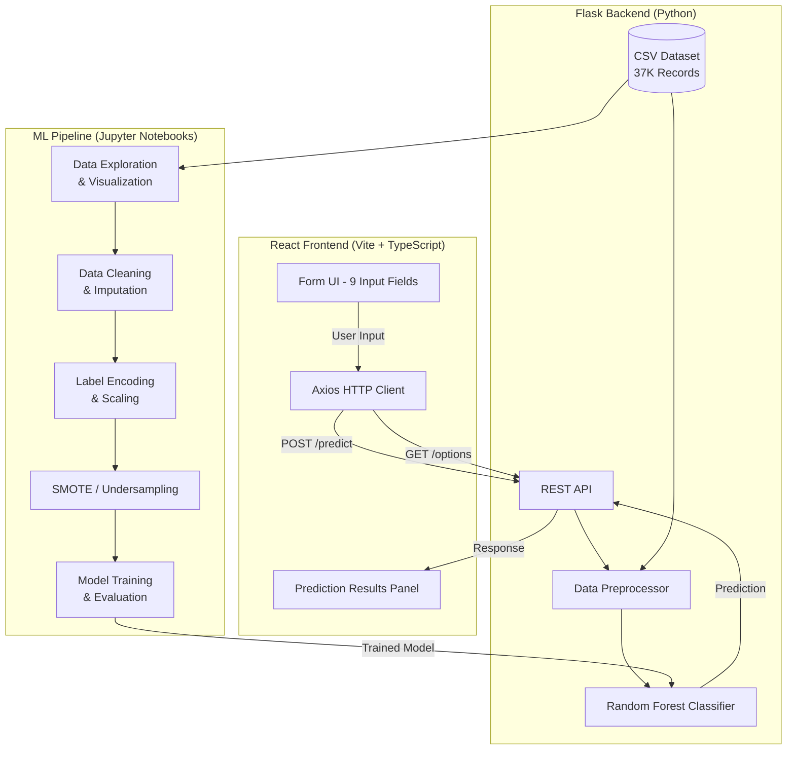

# :bike: Toronto Bicycle Theft Recovery Predictor

A full-stack machine learning application that predicts whether a stolen bicycle in Toronto is likely to be **recovered** or remain **stolen**, built on ~37,000 real incident records from the [Toronto Police Open Data Portal](https://data.torontopolice.on.ca/).

> **COMP309 — Group Assignment | Team 4**

---

## :bookmark_tabs: Table of Contents

- [:sparkles: Features](#-features)
- [:hammer_and_wrench: Tech Stack](#%EF%B8%8F-tech-stack)
- [:building_construction: Architecture](#-architecture)
- [:open_file_folder: Project Structure](#-project-structure)
- [:rocket: Getting Started](#-getting-started)
  - [Prerequisites](#prerequisites)
  - [Local Setup](#local-setup)
  - [Docker Setup](#docker-setup)
- [:globe_with_meridians: API Documentation](#-api-documentation)
- [:chart_with_upwards_trend: ML Pipeline](#-ml-pipeline)
- [:camera: Screenshots](#-screenshots)
- [:earth_americas: Environment Variables](#-environment-variables)
- [:white_check_mark: TODO / Roadmap](#-todo--roadmap)
- [:busts_in_silhouette: Team](#-team)

---

## :sparkles: Features

- **Data Exploration & Visualization** — Statistical analysis, correlation heatmaps, and distribution charts on 37K+ theft records
- **Automated Data Pipeline** — End-to-end ETL: cleaning, imputation, encoding, scaling, and class-imbalance handling
- **Multiple ML Models** — Random Forest, Logistic Regression, and Decision Tree classifiers with hyperparameter tuning via GridSearchCV
- **Class Imbalance Handling** — SMOTE oversampling, random undersampling, and balanced class weights
- **RESTful Prediction API** — Flask API serving real-time predictions with dynamic dropdown options
- **Interactive Web UI** — React + TypeScript frontend with a 9-field form for inputting theft details and viewing predictions
- **Model Evaluation** — Confusion matrices, ROC curves, AUC scores, precision/recall/F1, and feature importance rankings

---

## :hammer_and_wrench: Tech Stack

### Backend

| Technology | Purpose |
|---|---|
| **Python 3.10+** | Core language |
| **Flask** | REST API framework |
| **Flask-CORS** | Cross-origin request handling |
| **Pandas / NumPy** | Data manipulation & numerical computing |
| **Scikit-learn** | ML models, preprocessing, evaluation |
| **Imbalanced-learn** | SMOTE & undersampling for class imbalance |
| **Matplotlib / Seaborn** | Data visualization |
| **Pickle** | Model serialization |

### Frontend

| Technology | Purpose |
|---|---|
| **React 18** | UI component library |
| **TypeScript 5.6** | Type-safe JavaScript |
| **Vite 6** | Build tool & dev server |
| **Axios** | HTTP client for API calls |
| **ESLint** | Code quality & linting |
| **SWC** | Fast transpilation (via @vitejs/plugin-react-swc) |

### DevOps

| Technology | Purpose |
|---|---|
| **Docker** | Containerization |
| **Docker Compose** | Multi-service orchestration |
| **Git** | Version control |

---

## :building_construction: Architecture



---

## :open_file_folder: Project Structure

```
.
├── python_server/                    # Backend
│   ├── app.py                        # Data exploration, modeling & Flask API (combined)
│   ├── test.py                       # Data cleaning, wrangling, training & Flask API (production)
│   ├── Datamodelling.ipynb           # Interactive data modeling notebook
│   ├── trafficpolice.ipynb           # EDA notebook
│   ├── trafficpolice (1).ipynb       # Alternative EDA notebook
│   ├── Bicycle_Thefts_Open_Data.csv  # Raw dataset (~37K records)
│   ├── Bicycle_Thefts_Filtered.csv   # Filtered columns
│   └── Bicycle_Thefts_Filled_Numerical.csv  # Missing values imputed
│
├── react_client/                     # Frontend
│   ├── src/
│   │   ├── App.tsx                   # Main app component (form + prediction UI)
│   │   ├── main.tsx                  # React entry point
│   │   └── styles/
│   │       ├── App.css               # App-specific styles
│   │       └── index.css             # Global styles
│   ├── package.json                  # npm dependencies
│   ├── vite.config.ts                # Vite configuration
│   ├── tsconfig.json                 # TypeScript configuration
│   └── index.html                    # HTML entry point
│
├── Bicycle_Thefts_Filled_Numerical.csv  # Processed dataset (root copy)
├── Bicycle_Thefts_Filtered.csv          # Filtered dataset (root copy)
├── Dockerfile.backend                # Backend Docker image
├── Dockerfile.frontend               # Frontend Docker image
├── docker-compose.yml                # Multi-service orchestration
├── requirements.txt                  # Python dependencies
└── README.md                         # This file
```

---

## :rocket: Getting Started

### Prerequisites

- **Python 3.10+** and `pip`
- **Node.js 18+** and `npm`
- **Docker & Docker Compose** (optional, for containerized setup)

### Local Setup

**1. Clone the repository**

```bash
git clone https://github.com/<your-username>/DataWareHousing_FinalProject.git
cd DataWareHousing_FinalProject
```

**2. Start the backend**

```bash
# Install Python dependencies
pip install -r requirements.txt

# Run the Flask API (starts on http://127.0.0.1:5000)
python python_server/test.py
```

> The server loads the dataset, trains the Random Forest model, and exposes the API — this may take 30-60 seconds on first run.

**3. Start the frontend** (in a new terminal)

```bash
cd react_client

# Install npm dependencies
npm install

# Start the dev server (opens on http://localhost:5173)
npm run dev
```

**4. Open the app** at [http://localhost:5173](http://localhost:5173) and start predicting!

### Docker Setup

```bash
# Build and start both services
docker compose up --build

# Backend → http://localhost:5000
# Frontend → http://localhost:5173
```

To stop:

```bash
docker compose down
```

---

## :globe_with_meridians: API Documentation

### Base URL

```
http://127.0.0.1:5000
```

### Endpoints

| Method | Endpoint | Description |
|---|---|---|
| `GET` | `/options` | Returns dropdown options for all categorical features |
| `POST` | `/predict` | Predicts whether a stolen bike will be recovered |

### `GET /options`

Returns the unique values for each categorical feature from the dataset.

**Response:**

```json
{
  "DIVISION": ["D11", "D14", "D22", "D31", "D32", "D33", ...],
  "LOCATION_TYPE": ["Single Home", "Apartment", "Commercial", ...],
  "PREMISES_TYPE": ["Outside", "House", "Apartment", "Commercial", ...],
  "NEIGHBOURHOOD_158": ["Annex", "Beaches-East York", "Bay-Cloverhill", ...],
  "BIKE_TYPE": ["MT", "RG", "BM", "RC", "OT", ...]
}
```

### `POST /predict`

Accepts theft details and returns a recovery prediction.

**Request body:**

```json
{
  "OCC_YEAR": "2023",
  "OCC_MONTH": "July",
  "OCC_DOW": "Monday",
  "DIVISION": "D14",
  "LOCATION_TYPE": "Single Home",
  "PREMISES_TYPE": "Outside",
  "BIKE_TYPE": "MT",
  "BIKE_COST": "1500",
  "NEIGHBOURHOOD_158": "Annex"
}
```

**Response:**

```json
{
  "prediction": 0
}
```

| Value | Meaning |
|---|---|
| `0` | **STOLEN** — Bike is unlikely to be recovered |
| `1` | **RECOVERED** — Bike is likely to be recovered |

---

## :chart_with_upwards_trend: ML Pipeline

### Dataset

- **Source:** [Toronto Police Service — Bicycle Thefts Open Data](https://data.torontopolice.on.ca/)
- **Records:** ~37,000 bicycle theft incidents
- **Target Variable:** `STATUS` (STOLEN vs. RECOVERED)

### Pipeline Stages

```
Raw CSV → Filter Columns → Handle Missing Values → Remove UNKNOWN Status
        → Label Encode Categoricals → Standard Scale Numericals
        → Random Undersampling → Train/Test Split (80/20, stratified)
        → Model Training → Evaluation
```

### Features Used

| Feature | Type | Description |
|---|---|---|
| `OCC_YEAR` | Numeric | Year the theft occurred |
| `OCC_MONTH` | Categorical | Month of theft |
| `OCC_DOW` | Categorical | Day of the week |
| `DIVISION` | Categorical | Toronto Police division |
| `LOCATION_TYPE` | Categorical | Type of location (e.g., Single Home) |
| `PREMISES_TYPE` | Categorical | Premises type (e.g., Outside, Apartment) |
| `BIKE_TYPE` | Categorical | Bicycle type (MT, RG, BM, etc.) |
| `BIKE_COST` | Numeric | Estimated value of the bicycle ($) |
| `NEIGHBOURHOOD_158` | Categorical | Toronto neighbourhood (158-division system) |

### Models Evaluated

| Model | Imbalance Strategy | Hyperparameter Tuning |
|---|---|---|
| **Random Forest** (production) | Random Undersampling | Default (100 estimators) |
| **Logistic Regression** | SMOTE + Class Weights | GridSearchCV (C, solver) |
| **Decision Tree** | SMOTE + Class Weights | GridSearchCV (max_depth, min_samples_split) |

### Evaluation Metrics

- Accuracy, Precision, Recall, F1-Score
- Confusion Matrix
- ROC AUC Score
- Feature Importance Rankings

---

## :camera: Screenshots

### Prediction Form


*React frontend with 9 input fields for theft details*

### Prediction Results


*Recovery prediction output panel*

### Data Visualizations


*Feature correlation heatmap from EDA*


*Distribution of bicycle costs across theft records*

> **Note:** Add screenshots to `docs/screenshots/` to display them here.

---

## :earth_americas: Environment Variables

| Variable | Default | Description |
|---|---|---|
| `FLASK_PORT` | `5000` | Port for the Flask API server |
| `FLASK_DEBUG` | `true` | Enable Flask debug mode |
| `VITE_API_URL` | `http://127.0.0.1:5000` | Backend API URL for the React frontend |

---

## :white_check_mark: TODO / Roadmap

- [x] Data exploration and statistical analysis
- [x] Data cleaning and preprocessing pipeline
- [x] Multiple ML model training (Random Forest, Logistic Regression, Decision Tree)
- [x] Class imbalance handling (SMOTE, undersampling, class weights)
- [x] Model evaluation with comprehensive metrics
- [x] Flask REST API with `/options` and `/predict` endpoints
- [x] React + TypeScript frontend with interactive form
- [x] CORS configuration for cross-origin requests
- [x] Docker containerization (Dockerfile + docker-compose)
- [ ] Add `requirements.txt` with pinned versions
- [ ] Externalize API URL via environment variable (remove hardcoded `localhost`)
- [ ] Add Swagger/OpenAPI documentation
- [ ] Model serialization with Pickle (save/load trained model to avoid retraining)
- [ ] Add unit tests and integration tests
- [ ] Set up CI/CD pipeline (GitHub Actions)
- [ ] Move large CSV files to cloud storage or Git LFS
- [ ] Add user authentication for API endpoints
- [ ] Deploy to cloud (AWS/GCP/Azure or Railway/Render)

---

## :warning: Known Technical Debt

| Issue | Impact | Suggested Fix |
|---|---|---|
| API URL hardcoded in `App.tsx` | Breaks in non-local environments | Use environment variable via `import.meta.env` |
| Model retrains on every server start | Slow startup (~30-60s) | Serialize model with Pickle, load from file |
| Large CSV files in Git repo | Bloated repo size (~50MB+) | Use Git LFS or external storage |
| No `requirements.txt` with pinned versions | Dependency drift across environments | Pin exact versions |
| Duplicate imports in `app.py` and `test.py` | Code smell | Refactor into shared module |
| No input validation on `/predict` | Potential runtime errors | Add request schema validation |
| No automated tests | No regression safety net | Add pytest for backend, Vitest for frontend |

---

## :busts_in_silhouette: Team

| Name | Student ID |
|---|---|
| Benjamin Lefebvre | 301234587 |
| Noveen Mirza | — |
| Jeff Sy | — |
| Konain Zahra | — |

---

## :page_facing_up: License

This project was developed as part of COMP309 coursework at Centennial College.
